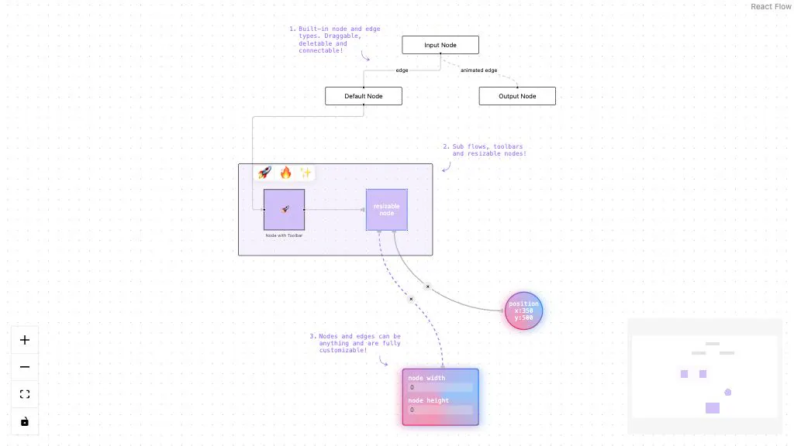

# react-flow



中文文档: http://react-flow.com

如果大家觉得有帮助, 欢迎点个小小的 `star`, 后续还会持续更新!

## Development

```bash
# install dependencies
$ pnpm install

# start dev server
$ pnpm start

# build docs
$ pnpm run build
```

## 更多优质项目

| 名称                                                                              | 描述                                                                            |
| --------------------------------------------------------------------------------- | --------------------------------------------------------------------------------------- |
| [H5-Dooring](https://github.com/MrXujiang/h5-Dooring)                             | 让 H5 制作像搭积木一样简单, 轻松搭建 H5 页面, H5 网站, PC 端网站, LowCode 平台.         |
| [V6.Dooring](https://github.com/MrXujiang/v6.dooring.public)                      | 可视化大屏解决方案, 提供一套可视化编辑引擎, 助力个人或企业轻松定制自己的可视化大屏应用. |
| [dooring-electron-lowcode](https://github.com/MrXujiang/dooring-electron-lowcode) | 基于 electron 的 H5-Dooring 编辑器桌面端.                                               |
| [DooringX](https://github.com/H5-Dooring/dooringx)                                | 快速高效搭建可视化拖拽平台.                                                             |
| [Mitu](https://github.com/H5-Dooring/mitu-editor)                                 | 一款轻量级且可扩展的图片/图形编辑器解决方案.                                            |
| [xijs](https://github.com/MrXujiang/xijs) | 一个开箱即用的面向业务的javascript工具库 |

## 贡献

欢迎对next感兴趣的朋友一起共建:

- 提交 [issues](https://github.com/MrXujiang/next-admin/issues) 来报告问题和优化建议.
- 主动 [pull requests](https://github.com/MrXujiang/next-admin/pulls) 来优化代码.

## 联系

微信: `cxzk_168`

## LICENSE

MIT
